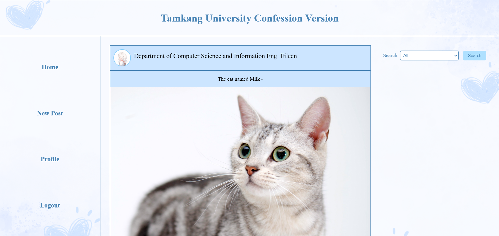
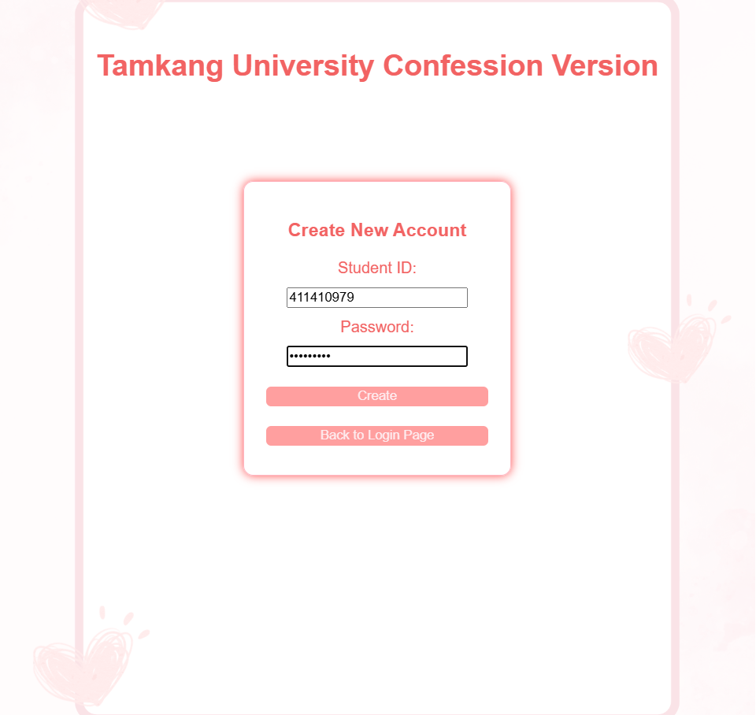
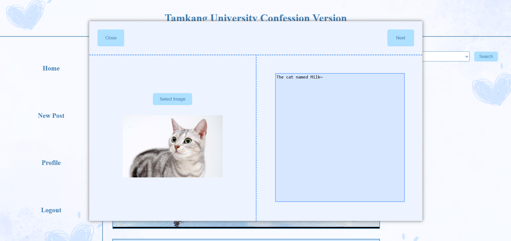
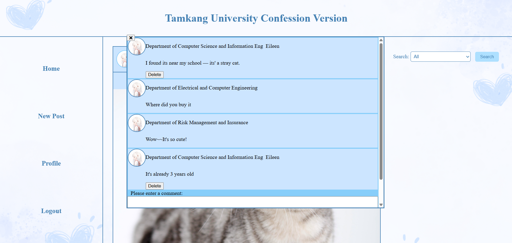

# Tamkang University Confession Board System – A Web Forum Developed with PHP & MySQL.
I developed a platform using HTML, PHP, and MySQL for students and faculty at Tamkang University to interact more freely. Unlike public forums, this system ensures privacy and restricts access to outsiders. Whether you want to express appreciation for a favorite professor or share frustrations about noisy classmates, you can do so without fear of judgment. Our anonymous posting feature allows everyone to speak their mind openly and safely—let’s create a space where honest conversations can thrive!
## Project Motivation
The development of this project reflects my strong interest in web application development and database-driven platforms. By building a forum system with login, posting, and commenting functionalities, my goal was to deepen my understanding of full-stack web development using PHP and MySQL.

This project also demonstrates my enthusiasm for designing user-centered interfaces and implementing backend logic. I plan to include it in my portfolio for applying to graduate programs in Computer Science, particularly in the areas of software engineering, system development, and applied data processing.
## Preview Screen

## Built With
- **Frontend**: HTML, CSS, JavaScript
- **Backend**: PHP
- **Database**: MySQL (via phpMyAdmin / XAMPP)
- **Development Environment**: XAMPP (Apache + MySQL)
- **Version Control**: Git & GitHub
## Screenshots
- Create a user account

- Create and publish a post

- Post a comment

## Key Features
- User registration and login/logout system
- Posting anonymous messages
- Commenting on posts
- Image upload support (optional)
## Reflection
Through this project, I enhanced my understanding of server-side scripting and database interaction, while also gaining practical experience in user interface structuring and error handling. This experience deepened my appreciation for the importance of data flow and user experience in web development.
## Contact
Name: Eileen (Hsu, Ying-Ying)

Email: xuyy04229@gmail.com

GitHub: https://github.com/EileenYY-Hsu
